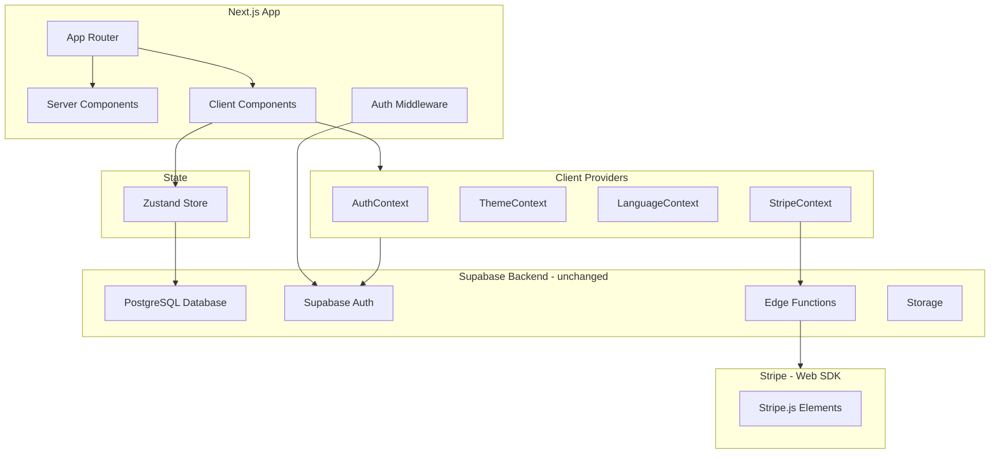

# FoilTribe: Expo to Next.js Web Rewrite

## Architecture Overview




## Technology Stack


| Current (Expo) | New (Next.js) |
| -------------- | ------------- |


- `expo-router` -> Next.js 14 App Router
- `react-native` -> Standard HTML elements
- `nativewind` -> Tailwind CSS v3 (mostly same classes)
- `@supabase/supabase-js` + AsyncStorage -> `@supabase/ssr` + cookies
- `@stripe/stripe-react-native` -> `@stripe/react-stripe-js` + `@stripe/stripe-js`
- `react-native-reanimated` -> `framer-motion`
- `lucide-react-native` -> `lucide-react`
- `expo-image` -> `next/image`
- `zustand` -> `zustand` (keep as-is)
- `expo-video` -> HTML5 `<video>` element
- `@react-native-async-storage` -> `localStorage` / cookies

## Route Structure

```
app/
  layout.tsx              # Root layout (providers, fonts, metadata)
  page.tsx                # Landing/welcome page (hero, CTA)
  globals.css             # Tailwind base + custom theme vars

  (auth)/
    login/page.tsx        # Email/password + OAuth
    signup/page.tsx       # Registration
    forgot-password/page.tsx

  (main)/
    layout.tsx            # Navbar + footer layout
    page.tsx              # Explore (home feed - hero, pricing, how it works)
    activities/
      page.tsx            # Activity showcase/listing
      [slug]/
        page.tsx          # Activity detail (gallery, highlights, included)
    bookings/page.tsx     # My bookings
    crew/page.tsx         # Airline crew quick booking

  booking/
    select-time/page.tsx  # Calendar, trip slots, guest count
    checkout/page.tsx     # Checkout (contact, promo, payment)
    success/page.tsx      # Booking confirmation
    trip-status/[id]/page.tsx  # Group payment tracking
    crew-summary/page.tsx # Crew booking summary

  settings/
    page.tsx              # Settings list
    profile/page.tsx      # Edit profile
    notifications/page.tsx # Notification prefs

  how-it-works/page.tsx   # How it works guide
```

## What Gets Reused (Minimal Changes)

These files port almost directly with minor import changes:

- `**[lib/supabase.ts](lib/supabase.ts)**` -- Recreate using `@supabase/ssr` `createBrowserClient()` for client, `createServerClient()` for server components
- `**[lib/database.types.ts](lib/database.types.ts)**` -- Copy as-is
- `**[lib/utils.ts](lib/utils.ts)**` -- Copy as-is (already uses `clsx` + `tailwind-merge`)
- `**[data/tripsDb.ts](data/tripsDb.ts)**` -- Copy, update Supabase client import
- `**[data/pricing.ts](data/pricing.ts)**` -- Copy as-is
- `**[data/activities.ts](data/activities.ts)**` -- Copy as-is
- `**[data/types.ts](data/types.ts)**` -- Copy as-is
- `**[store/useStore.ts](store/useStore.ts)**` -- Copy, replace AsyncStorage with localStorage
- `**[contexts/LanguageContext.tsx](contexts/LanguageContext.tsx)**` -- Copy, replace AsyncStorage with localStorage
- `**[contexts/ThemeContext.tsx](contexts/ThemeContext.tsx)**` -- Simplify, use `next-themes` or CSS `prefers-color-scheme`
- `**[supabase/](supabase/)**` directory -- Keep entirely as-is (Edge Functions unchanged)

## Key Implementation Details

### 1. Supabase Auth (SSR)

Use `@supabase/ssr` with Next.js middleware for auth:

- **Browser client**: `createBrowserClient()` in a `lib/supabase-browser.ts`
- **Server client**: `createServerClient()` in `lib/supabase-server.ts` using cookies
- **Middleware**: `middleware.ts` at project root to refresh auth tokens on every request
- Replace Apple Sign-In native SDK with Supabase OAuth provider (`supabase.auth.signInWithOAuth({ provider: 'apple' })`)

### 2. Stripe Web Integration

Replace React Native Stripe SDK with web Stripe Elements:

- Wrap app with `<Elements>` from `@stripe/react-stripe-js`
- Use `PaymentElement` or `CardElement` instead of `PaymentSheet`
- Keep calling same Supabase Edge Functions (`payment-sheet`, `payment-link`)
- Payment Links (for group sharing) work natively on web -- no changes needed

### 3. Navigation Mapping

- **Bottom tabs** -> Top navbar with links (Explore, Activities, Bookings, Crew)
- **Drawer** -> Responsive sidebar or mobile hamburger menu
- **Stack screens** -> Next.js page routes
- **Modals** -> Dialog components (headless UI or custom) or separate routes

### 4. Component Migration Strategy

Each React Native component maps to an HTML equivalent:

- `<View>` -> `<div>`
- `<Text>` -> `<p>`, `<span>`, `<h1>`-`<h6>`
- `<ScrollView>` -> `<div className="overflow-y-auto">`
- `<TouchableOpacity>` / `<Pressable>` -> `<button>` or `<a>`
- `<Image>` -> `<Image>` from `next/image`
- `<FlatList>` -> `.map()` with CSS grid/flex
- `<TextInput>` -> `<input>` / `<textarea>`
- NativeWind classes -> Tailwind classes (mostly identical)

### 5. Animations

Replace `react-native-reanimated` with `framer-motion`:

- `AnimatedView` component -> `motion.div` with `initial`, `animate`, `transition`
- Collapsible header -> CSS `sticky` positioning + scroll-based opacity
- Page transitions -> `framer-motion` `AnimatePresence`

### 6. Assets

- Copy all images from `assets/img/` to `public/img/`
- Copy airline logos from `Logos/` to `public/logos/`
- Videos from `assets/img/imagesmaldivesa/videos/` to `public/videos/`
- Use `next/image` with proper `width`/`height` or `fill` props

### 7. Theme System

- Port color variables from `[utils/color-theme.ts](utils/color-theme.ts)` to CSS custom properties in `globals.css`
- Use Tailwind `dark:` variant for dark mode
- Consider `next-themes` package for theme persistence

## Files to Create (estimated ~40 files)

### Config (4 files)

- `package.json`, `next.config.js`, `tailwind.config.ts`, `tsconfig.json`

### Lib (4 files)

- `lib/supabase-browser.ts`, `lib/supabase-server.ts`, `lib/database.types.ts`, `lib/utils.ts`

### Data Layer (4 files, mostly copied)

- `data/tripsDb.ts`, `data/pricing.ts`, `data/activities.ts`, `data/types.ts`

### State (3 files)

- `store/useStore.ts`, `contexts/AuthContext.tsx`, `contexts/StripeContext.tsx`

### Layouts + Pages (~18 files)

- Root layout, auth pages (3), main layout + pages (5), booking flow (4), settings (3), how-it-works, middleware

### Components (~15-20 core files)

- `Navbar.tsx`, `Footer.tsx`, `Button.tsx`, `Card.tsx`, `Header.tsx`, `Input.tsx`, `TripCard.tsx`, `TripCalendar.tsx`, `PriceTierIndicator.tsx`, `ImageCarousel.tsx`, `VideoPreview.tsx`, `Avatar.tsx`, `SkeletonLoader.tsx`, `AnimatedDiv.tsx`, `ThemeToggle.tsx`, etc.

## Excluded from Rewrite (per scope decision)

- Notes system (`NotesContext`, note screens)
- Categories system
- Legacy flight booking flow (keep only simplified crew flow)
- Lottie animations (replace with CSS or Framer Motion)
- Push notifications (skip for web MVP; can add web push later)
- Camera/image picker (use standard HTML file input for avatar upload)
- Location permissions (use browser Geolocation API if needed)
- Calendar integration
- RevenueCat subscriptions

